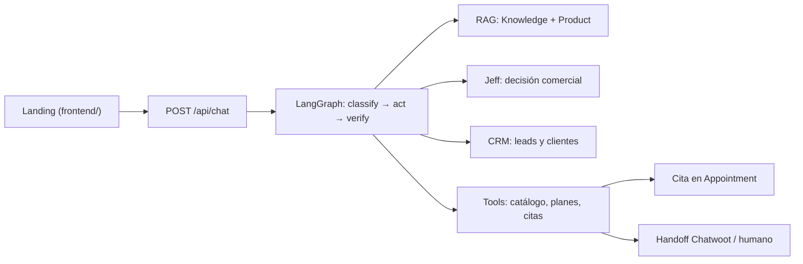

# Agent Ventas

Agente de **ventas** IA para PyMEs: no es un chatbot de atención genérico. El
objetivo de cada conversación es calificar al lead, responder únicamente con
datos reales de la empresa, agendar una cita o derivar a un humano — cerrar,
no "responder dudas".

## Arquitectura



- **Landing** (`frontend/`): página estática servida por FastAPI en `/`, con
  el widget de chat que identifica el tenant (`public_key`) contra
  `POST /api/chat`. Spec §18-19.
- **API**: FastAPI - `/api/chat` (conversación, rate limit por IP, 429),
 `/api/leads` + `/api/appointments` (CRM de lectura con `?token=`:
 `Business.crm_token` por cliente → solo su tenant (H20), o `CRM_TOKEN`
 global de operador → todos; rate limit también en GET (H19);
 401 `invalid_crm_token`), `/health` (liveness) y `/ready`
 (SELECT 1 contra la DB). `ChatResponse` expone `lead_id`,
 `lead_temperature`, `handoff` y `next_step` (Jeff).
- **Grafo** (`app/agent/graph.py`): `classify → act → verify`. El verificador
  es determinista: si el draft no pasa, responde fallback seguro. Spec §3.
- **RAG** (`app/rag/`): retrieval sobre `Knowledge` y `Product` filtrado por
  `business_id`; sin evidencia, el agente no inventa. Spec §3.
- **Jeff** (§13): decisión comercial — qué ofrecer, cuándo empujar al cierre.
  Sus reglas cubren `HANDLE_OBJECTION` (objeciones), `CLOSE`/`SCHEDULE`
  (cita creada) y `FOLLOW_UP` (lead estancado), y su `next_step` **se inyecta
  al system prompt** (`STEP_DIRECTIVES`): el LLM sabe si le toca cerrar,
  agendar, manejar objeción o descubrir en cada llamada.
- **CRM** (§11-12): `Lead` con temperatura/estado, `Customer` con `facts`,
  resumen de conversación. Spec §11-12.
- **Persona** (`app/agent/personas.py` + `Business.persona`): 5 bloques
  (identidad, voz, catálogo, manejo de objeciones, cierre) compilados a
  `dynamic_persona` e inyectados en el system prompt; si el tenant no tiene
  `persona`, cae al default. Migración Alembic `d5f4608edf79`.
- **Salidas**: cita en `Appointment` (calendario) o handoff a humano/Chatwoot
  (`Conversation.state = human`). Spec §15-16. El booking es **determinista**:
  cuando el cliente confirma con slots ofrecidos, el backend crea la cita
  (`is_booking_confirmation` + `pick_slot` en `policies.py`), la liga al
  `Lead` (`appointments.lead_id`), lo hace `qualified` con `next_action`
  "Cita agendada para …", y el humano la ve en `GET /api/appointments`
  (`CRM_TOKEN`).
- **Info externa** (§14): búsqueda web opcional por negocio
  (`EXTERNAL_SEARCH_ENABLED`), registrada en `ExternalSearch`.
- **Persistencia**: PostgreSQL + Alembic; tokens/costo por mensaje en
  `Message`, auditoría de turnos en `EventLog`, presupuesto §21. Spec §20-21.

## Stack y decisiones

- **Python 3.14 + FastAPI + Uvicorn**: el runtime es el mismo en dev, CI y
  Docker (`python:3.14-slim`).
- **LangGraph** para el grafo de conversación; el verificador
  (`app/agent/verifier.py`) es código propio determinista — no se le confía
  al LLM la última palabra.
- **SQLAlchemy 2.0** (`Mapped`/`mapped_column`) + **Alembic**. El schema vive
  en `alembic/versions/`; migrar es `alembic upgrade head`.
- **PostgreSQL 17** en dev/prod; **SQLite** solo en tests (la suite corre sin
  servicios).
- **Groq** detrás de la abstracción `LLMProvider`; sin `GROQ_API_KEY` en dev
  se usa `FakeProvider` offline y determinista (nunca en prod:
  `validate_runtime()` lo rechaza). Costo por turno controlado en
  `app/llm/groq.py`: `reasoning_effort=low` (output ~3x menor medido),
  `cost_est` con el descuento de prompt caching automático de Groq (50% en
  `gpt-oss-20b`; medido 768/988 tok cacheados con el system prompt actual)
  y reintentos (3 intentos) para 429/5xx y el 400 `tool_use_failed`
  (2ª pasada del grafo sin tools emite un tool call ~1 de cada 4 con
  `reasoning_effort=low`). El system prompt
  (`app/agent/prompts.py`, ~870 tokens, antes ~2.500) es la parte fija
  cacheable: si lo editás, re-medí `tokens_in` en `EventLog`.
- **Requirements pineados (`==`)**: los builds son reproducibles; un `>=`
  suelto rompe Docker/CI cada vez que sale un release. `pytest` vive en
  `requirements-dev.txt` para que la imagen de runtime no lleve el test
  runner instalado.
- **Multi-tenant**: toda query filtra por `business_id`.
- **Secretos solo por environment**: `.env` no entra a la imagen
  (`.dockerignore`) ni al repo (`.gitignore`).

## Desarrollo local

```bash
python3 -m venv .venv
source .venv/bin/activate
pip install -r requirements-dev.txt
cp .env.example .env   # pon tu GROQ_API_KEY (sin key usa FakeProvider offline)
```

### Postgres dev

El repo usa `DATABASE_URL` de `.env`. Si tu Postgres del sistema pide
credenciales que no tienes, levanta un cluster propio sin sudo:

```bash
initdb -D /tmp/opencode/pgdata -U agent -A trust
pg_ctl -D /tmp/opencode/pgdata -o "-p 5433 -k /tmp/opencode" -l /tmp/opencode/pg.log start
psql "host=/tmp/opencode port=5433 user=agent dbname=postgres" -c "create database agent_ventas;"
```

### Migraciones, seed y servidor

```bash
alembic upgrade head          # schema a head (create_all NO altera columnas)
python -m app.db.seed_demo    # negocio demo, productos, leads
python -m app.rag.seed_knowledge
uvicorn app.main:app --reload --port 8000
```

Abrir http://127.0.0.1:8000

## Tests

```bash
pytest -q          # == make test  (155 tests)
```

La suite usa SQLite en `/tmp/opencode/` y `FakeProvider`; no necesita Postgres
ni API key. El CI sí corre los tests contra Postgres 17 para validar las
migraciones reales (`alembic upgrade head` antes de `pytest`).

## Docker

```bash
docker compose up --build     # == make up
```

- `app` (build del `Dockerfile`): corre `alembic upgrade head` y después
  uvicorn en `:8000`. Usuario no-root, healthcheck contra `GET /health`,
  `TZ=UTC` (el código usa `datetime.now()` naive — AUDITORIA.md H14).
- `db` (`postgres:17-alpine`): volumen nombrado `pgdata`, healthcheck
  `pg_isready`; el servicio `app` arranca solo cuando `db` está sano.

```bash
docker compose logs -f app    # == make logs
docker compose down           # == make down  (el volumen pgdata persiste)
```

`docker compose` lee el `.env` del repo para interpolación: `GROQ_API_KEY`,
`POSTGRES_USER`, etc. fluyen al stack sin editar el YAML.

## Variables de entorno (`.env.example`)

| Variable | Default | Qué hace |
|---|---|---|
| `APP_ENV` | `dev` | `dev` o `prod`. En `prod` aplica `validate_runtime()` (ver checklist). |
| `GROQ_API_KEY` | vacío | Key de Groq. Vacío en dev → `FakeProvider`; en prod es obligatoria. |
| `LLM_MODEL` | `openai/gpt-oss-20b` | Modelo Groq detrás de `LLMProvider`. |
| `DATABASE_URL` | `postgresql+psycopg://agent@127.0.0.1:5433/agent_ventas` | URL de la DB. En prod debe ser remota (sin `localhost`/`127.0.0.1`); en compose ya apunta al servicio `db:5432`. |
| `RATE_LIMIT_PER_MIN` | `30` | Ventana de rate limit por IP (60 s) en `/api/chat`, `/api/leads`, `/api/webhook/chatwoot` (POST) y `GET /api/leads`/`/api/appointments` (H19); excederla responde 429. |
| `DAILY_TOKEN_BUDGET` | `200000` | Presupuesto de tokens por día (spec §21); default de `Business.daily_token_budget`. |
| `ALLOW_FAKE_LLM` | `true` | `false` exige `GROQ_API_KEY` siempre (falla ruidoso en vez de responder con datos inventados). |
| `EXTERNAL_SEARCH_ENABLED` | `true` | Habilita búsqueda externa (spec §14). Cada negocio puede sobreescribirlo en BD. |
| `CHATWOOT_URL` / `CHATWOOT_TOKEN` | vacío | Integración Chatwoot (spec §15). Vacío = inactiva; por negocio en BD. |
| `ALLOWED_ORIGINS` | `*` | Origen del widget, coma-separado. `*` solo en dev. |
| `LANDING_PUBLIC_KEY` | vacío | Clave pública del tenant dueño de la landing en `/`. El servidor la inyecta en `window.AGENT_VENTAS_KEY`; vacío = el widget acepta `?key=<public_key>` en la URL. |
| `CRM_TOKEN` | vacío | Token de **operador** de `GET /api/leads` y `GET /api/appointments` (`?token=`): ve todos los tenants. Los clientes usan su `Business.crm_token` (H20), que solo ve su negocio. Sin ningún token configurado → 403 `crm_disabled`. |
| `POSTGRES_USER` / `POSTGRES_PASSWORD` / `POSTGRES_DB` | `agent` / `agent` / `agent_ventas` | Credenciales del servicio `db` (solo interpolación de compose). |

## Makefile

| Target | Qué hace |
|---|---|
| `make dev` | `uvicorn app.main:app --reload --port 8000` |
| `make test` | `python3 -m pytest -q` |
| `make migrate` | `alembic upgrade head` |
| `make seed` | seed demo + conocimiento RAG |
| `make up` | `docker compose up --build` |
| `make down` | `docker compose down` |
| `make logs` | `docker compose logs -f app` |
| `make lint` | `python -m compileall app` — no hay linter/formatter configurado en el repo; esto caza errores de sintaxis y es todo lo que hoy se puede correr barato. |

## Puesta en producción

Checklist, en orden:

1. **`APP_ENV=prod`** — activa `settings.validate_runtime()` (fail-fast en
   `app/config.py`). Verificación directa, sin levantar el stack:

   ```bash
   APP_ENV=prod docker compose run --rm app python -c \
     "from app.config import settings; settings.validate_runtime()"
   ```

   Debe fallar con `RuntimeError` si falta `GROQ_API_KEY` o si `DATABASE_URL`
   apunta a `localhost`/`127.0.0.1`.
2. **`GROQ_API_KEY` obligatoria** — sin ella en prod el bot caería en
   `FakeProvider` y "respondería" con datos inventados; `validate_runtime()`
   lo bloquea. Inyectala por env (nunca en la imagen ni en el repo).
3. **Migraciones con Alembic** — el `CMD` del contenedor ya ejecuta
   `alembic upgrade head` antes de arrancar uvicorn; manual:
   `docker compose exec app alembic upgrade head`. Todo cambio de schema es
   una migración nueva (`alembic revision --autogenerate`), nunca `create_all`.
4. **Rate limit por IP persistido en BD** — `RateLimitMiddleware`
   (`app/middleware.py`) limita a `RATE_LIMIT_PER_MIN` (30/min por IP) y
   responde 429 en `POST /api/chat`, `/api/leads` y `/api/webhook/chatwoot`;
   `/health` y `/ready` quedan libres. La ventana vive en la tabla
   `RateLimitBucket` (upsert por `bucket_key` + minuto), así que el límite es
   correcto con varias réplicas de uvicorn y sobrevive reinicios. Si la BD del
   contador falla, hace fail-open para no cortar el chat.
5. **Presupuesto diario de tokens** — `DAILY_TOKEN_BUDGET` /
   `Business.daily_token_budget` (200 000 tokens/día por negocio). El gasto
   queda por mensaje en `Message` (`tokens_in`, `tokens_out`, `cost_est`) y
   por turno en `EventLog`; monitoreá esas tablas antes de que una fuga de
   prompt se coma la cuenta de Groq.
6. **Secretos solo por env** — `.env` con permisos `600`, fuera del repo y
   fuera de la imagen (ya excluido por `.dockerignore`). Rotación: cambiar la
   variable y recrear el contenedor; nada de secretos en `Dockerfile`,
   compose o código.
7. **TLS terminado en el proxy** — elegimos **Caddy** delante de uvicorn:
   obtiene y renueva certificados Let's Encrypt automáticamente, con una
   config de ~4 líneas (`reverse_proxy 127.0.0.1:8000`) y un proceso menos
   que mantener que nginx o Traefik. El compose publica `8000`; exponelo solo
   en loopback/red interna y poné el dominio real en `ALLOWED_ORIGINS`.
8. **Backups de Postgres** — volumen nombrado `pgdata`; dump diario y prueba
   de restore:

   ```bash
   docker compose exec -T db pg_dump -U agent -d agent_ventas | gzip > "backup-$(date +%F).sql.gz"
   # restore (probar en un entorno antes de necesitarlo):
   gunzip < backup-2026-09-24.sql.gz | docker compose exec -T db psql -U agent -d agent_ventas
   ```

   Copiá los dumps fuera de la máquina (el volumen solo vive en el host).
9. **Rotar una `public_key`** — identifica al tenant en el widget; no es
   secreta administrativa, pero si se filtra en un sitio que no controlás,
   rotala y re-embebela en la landing:

   ```bash
   NUEVA=$(python3 -c "import secrets; print(secrets.token_urlsafe(24))")
   docker compose exec -T db psql -U agent -d agent_ventas \
     -c "UPDATE businesses SET public_key = '$NUEVA' WHERE id = 1;"
   ```

   La clave vieja deja de resolver de inmediato (columna `unique`).

## Despliegue en Cloudflare (gratis, sin dominio ni plan de pago)

La landing vive en `/home/diego/Factory/web/saleamind1` (Next.js) y se
publica junto al backend con planes gratuitos. Cloudflare **Containers no
está disponible** (requiere Workers Paid) y **Cloudflare no aloja Postgres**,
así que el cómputo del backend queda en esta máquina y solo el borde está en
Cloudflare:

| Pieza | Dónde queda | Cómo se levanta |
|---|---|---|
| Landing | Worker `salesmind.<cuenta>.workers.dev` | `npm run build && npx wrangler deploy --var ANA_API_URL:<tunnel>` |
| API (`:8000`) | esta máquina | `TRUST_PROXY_HEADERS=true uvicorn app.main:app --port 8000` |
| Postgres | esta máquina | `docker compose up db` (hoy corre el cluster local de `/tmp/opencode`) |
| Puente público | quick tunnel de cloudflared | `cloudflared tunnel --url http://127.0.0.1:8000` |

La landing se exporta **estática** (`output: "export"` en `next.config.mjs`):
HTML/JS/CSS van a Workers Static Assets y `src/index.ts` hace de proxy de
`/api/ana/*` hacia el tunnel. El navegador habla siempre en el mismo origen,
así que no hay CORS. Ese proxy hace tres cosas:

1. **Reenvía `X-Real-IP`** con `CF-Connecting-IP`. En el segundo salto
   (Worker → tunnel) Cloudflare sobrescribe `X-Forwarded-For` con su propia
   IP de salida: sin este header todos los visitantes compartirían **un** bucket
   de 30/min y el límite saltaría enseguida. El backend lo honra solo con
   `TRUST_PROXY_HEADERS=true` — fuera de Cloudflare el header es spoofable.
2. **Reintenta una vez ante 530**: el edge no alcanzó al tunnel y el origen
   nunca vio el request, así que el reintento no duplica mensajes ni leads.
3. Si `ANA_API_URL` está vacía responde `502 backend_not_configured` en vez
   de fallar mudo.

El cliente de la landing (`lib/ana.ts`) manda `public_key`, nunca
`business_id` (spec §22); sin clave o desconocida el backend responde 401.

### Limitaciones conocidas de este arreglo

- **Quick tunnel sin dominio**: la URL `*.trycloudflare.com` **cambia en cada
  reinicio** de cloudflared. Después de reiniciar hay que redeployar la
  landing con la URL nueva. Cloudflare advierte que estos tunnels no tienen
  SLA; con una zona en la cuenta se pasa a un tunnel nombrado y el hostname
  queda fijo (requiere `cloudflared tunnel login`, que abre el browser).
- **Todo depende de esta máquina**: si se apaga, caen la API y la DB.
- El Postgres de desarrollo vive en `/tmp/opencode/pgdata`, que **se pierde al
  reiniciar el host**. Sirve para probar; antes de producción moverlo a
  `docker compose up` (volumen `pgdata`, ya en el repo) o a un servicio
  gestionado. Requiere el daemon de Docker levantado.

### Autoarranque, backups y costos

- **`deploy/README.md`** — unidades de systemd *de usuario* listas para copiar
  (API + tunnel + watcher de URL + backup diario) con la instalación manual
  (`systemctl --user`, `loginctl enable-linger`), el estado de la credencial
  de Postgres y el plan B con SQLite en `data/`. Nada está instalado todavía.
- **`docs/COSTOS.md`** — desglose del coste actual (**$0/mes**: Workers free,
  quick tunnel, host local), los riesgos de ese tier y la alternativa mínima
  de pago (VPS ~€4-5/mes) por si algún día deja de servir.

## Decisiones abiertas conocidas

- **`init_db()` hace `create_all` en el startup** (`app/db/database.py`): solo
  crea tablas *faltantes*, nunca altera columnas — el schema vivo lo define
  Alembic y el `CMD` del contenedor corre `alembic upgrade head` antes de
  uvicorn. Se mantuvo para que dev/tests arranquen sin servicios; eliminarlo
  del startup queda pendiente de tocar `app/db/database.py`.
- **`validate_runtime()` está cableado al arrancar** (`app/main.py` →
  `lifespan`): en `APP_ENV=prod` el proceso no arranca sin `GROQ_API_KEY` ni
  con `DATABASE_URL` apuntando a localhost. El comando del punto 1 del
  checklist lo prueba sin levantar el stack.
- **Rate limit por IP** — persistido en `RateLimitBucket` vía
  `RateLimitMiddleware` (ver punto 4); correcto con múltiples réplicas.
- **`datetime.now()` naive (H14)** — mitigado con `TZ=UTC` en imagen, compose
  y CI; migrar el código a datetimes timezone-aware sigue abierto.
- **Sin linter/formatter** — no hay ruff/black/flake8 configurado;
  `make lint` es `compileall` a propósito, no un linter inventado. Sumar uno
  significa agregarlo a `requirements-dev.txt` y al CI.
- **Frontend sin build** — `frontend/` se sirve estático desde FastAPI. Si
  crece a un build de Node, `.dockerignore` ya excluye
  `frontend/node_modules` y `frontend/dist`.

## Auditoría

`AUDITORIA.md` es la auditoría de seguridad del núcleo (lectura de código,
ataques estáticos contra el bloqueo de inyección y el verificador, sondas en
vivo con Groq), con hallazgos H1-H18 y su estado. Las decisiones de este
despliegue salen de ahí: `TZ=UTC` en todos los entornos (H14), rate limit 429
+ respuesta de captura ante cuota agotada (H16), secretos fuera de la imagen.

Antes de cada release: releer los hallazgos con estado **ABIERTO** en
`AUDITORIA.md` y correr la suite (`pytest -q`, CI en `main`/`master`).
